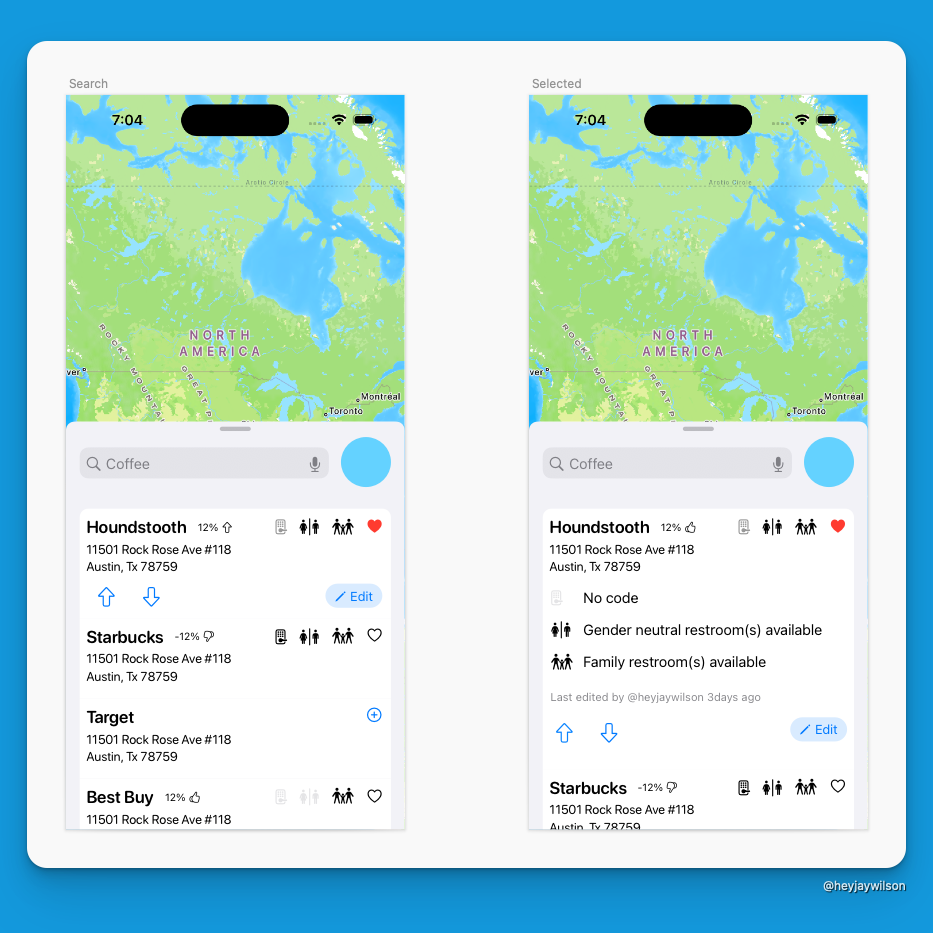
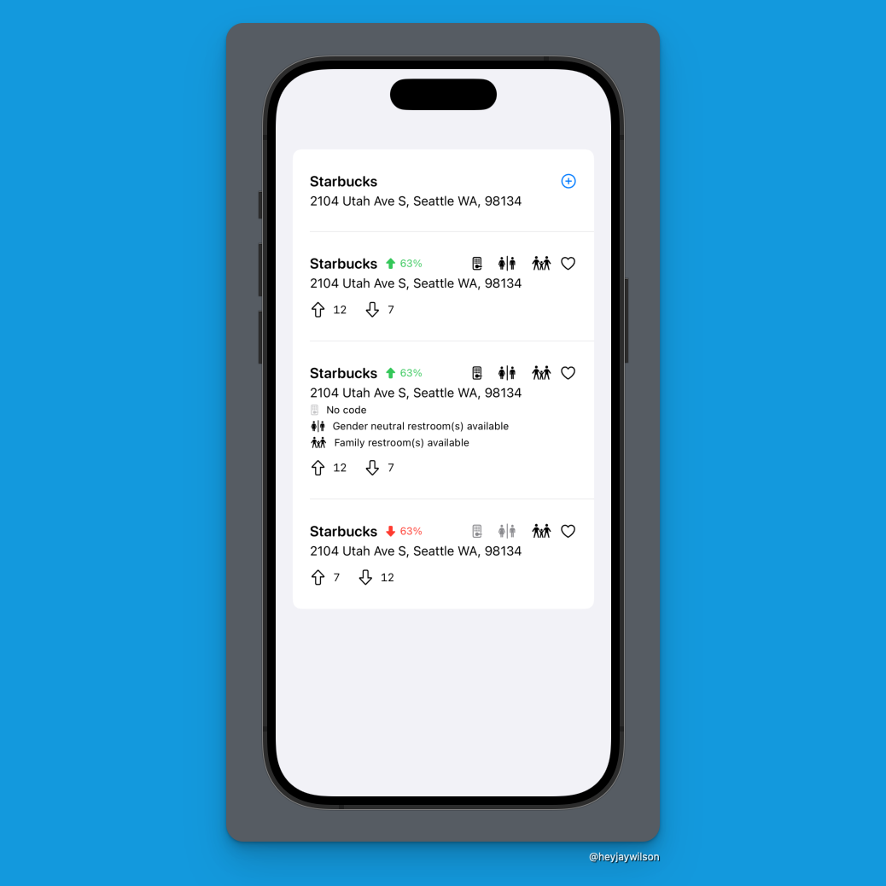

## What I accomplished this week

I didn't do too much this week, but I did settle on how the lists of places will look. I usually design in code cause it's easier and quicker, but this was not one of those times. I have a lot of information I want to present in each row, so I decided to turn to work in Sketch and figure out what it should look like.

There are 3 states here.

1. **Add a place**. It doesn't exist in my database. This is Target in the screenshot. It has the the `+` sign.
2. **Not selected place**. It exists in my database, but the user has not selected it to get more info. It's a lot of icons in the top row, but that's okay. The user can also upvote/downvote and update the location.
3. **Selected place**. It exists in my database, and the user has selected it. This is Houndstooth in the design on the right. It explains the icons and what the location has restroom wise. The user still has access to upvote/downvote and edit.

Again, these are all designs and my intentions. Here's what I ended up with in SwiftUI previews.

The key differences is the size of the arrows, the number of upvotes and downvotes, and the edit button is gone. I made the choice to remove the edit button and replace it with either a swipe action or a context menu, since I don't think it will be used too often and it wasn't a crazy thought since [@steve228uk](https://www.threads.net/@steve228uk) suggested it on my [threads post](https://www.threads.net/@steve228uk/post/C_V5B7UtLb5?xmt=AQGzJhNNJbxi4nSc08lLiySJEfJ8uMEKAk-7pHkpK8gb1A). 

## What's next?

- Update the data and get the view to adjust in real time. This might take some actual work since I don't think I really built this in a way to respond to the data like that
- Update the server to retrieve the data
- Update the server to edit for specific properties like upvoting/downvoting
- Implement favorites. Which I think will be the paid part of this app. A small yearly subscription to help cover server costs.

## Will I meet the Ship-a-ton deadline?

I don't think I will and that's okay. I'll keep working and trying to though and see how close I get.

## Previous Dev Logs for FindRelief

- [Log 1](/blog/2024/08/13-ship-a-ton)
- [Log 2](/blog/2024/08/16-ship-a-ton-log-2)