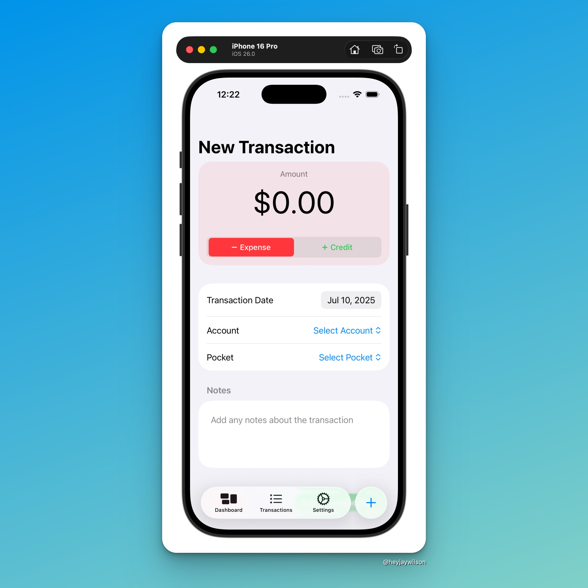

I didn't really figure out the issue from earlier, but I did find a solution. I just had to use a different formatter. Since, I'm not writing test right now, I had to create a `TransactionsListView` to display the list of transactions to make sure they were added correctly. Once that was confirmed, I tweaked the design a bit and now I have this New Transaction view.

I'm pretty happy with the design, but I still need to figure out some UX around what happens after the transaction is saved or cancelled.

My next task is to implement the functionality for views to update when data is saved.
