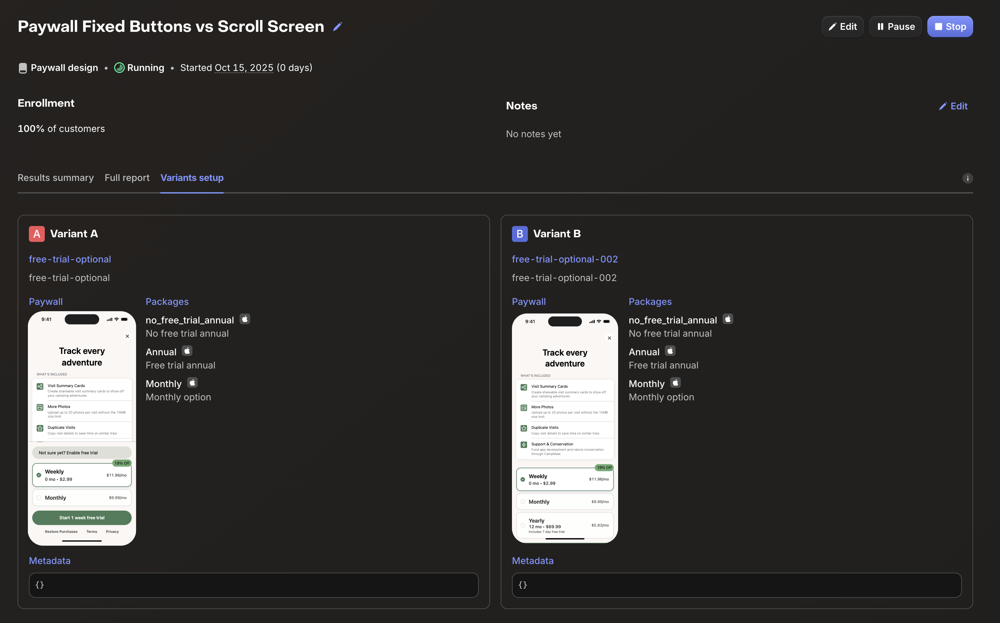

Today, I started my first paywall experiment for [Camp Notes](https://campnotes.app). I don't really have enough users to make it worth it, but I want to try it out anyway. I am comparing a fixed footer always showing the package buttons with a toggle for a free trial to one long scroll with the free trial option as a button like the non trial options.

What I'm hoping to learn is if users are more likely to convert if they have to scroll or not. I'm also curious if people will switch to the free trial version at all.

Ideally this experiment is ran until at least 35 users have gone through it, but I think that'll take a really long time considering I've only had 4 users start a trial since I launched on September 6th. If I haven't hit 35 users by December 15th (2 months from now), then I'll stop the experiment and choose the option that had slightly better results even if it's not statistically significant.

>[!NOTE] The prices in this screen are the placeholders that RevenueCat generates in their app so I can preview the paywalls.

---

This experiment is part of my goal to hit $1000 MRR by October 2026. You can follow that journey on [YouTube](https://www.youtube.com/watch?v=WRvNgOdpxPU&list=PLN6lLzliju3Ccvwd_OLEddnUL8hLlv1fQ), [Instagram](https://www.instagram.com/heyjaywilson/), or right here on my blog.

- Current MRR: $33
- Goal MRR: $1000
- Months left: 11
