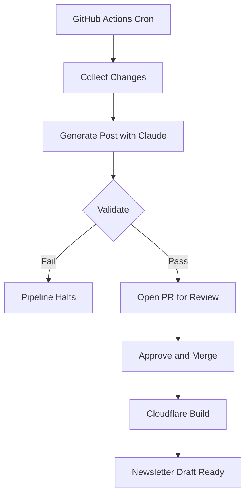

JABA has three active repos: iOS, backend, and website. Meaningful work ships across all of them every two weeks, and users and newsletter subscribers deserve to know what changed. Consistent content about what's being built matters for SEO too. The problem was that writing updates kept falling off my plate. I'd miss a cycle, feel behind, and the gap would grow.

I built a pipeline to fix that. It pulls from all three repos, collects merged PRs and commits, and turns them into a published blog post every two weeks without me writing anything.

## What the Pipeline Does

A GitHub Actions workflow runs on odd-numbered Thursdays. It collects recent merged PRs and commits from all three repos, hands them to Claude with a carefully defined prompt, validates the output, and opens a PR on the Hugo site for my review. I approve it, Cloudflare builds, and the post goes live. Newsletter content falls out the other side automatically.

Here's the full flow:



## The Five Scripts

The pipeline is five Node.js scripts chained with piped I/O. Each reads from stdin and writes to stdout. Every script is independently testable, and failed runs leave intermediate files in `/temp` so it's easy to see exactly where things broke.

Here's how the repo is structured:

```text
automated-dev-updates-newsletter/
  ├── config/
  │   ├── frontmatter-template.yaml
  │   ├── repos.json
  │   └── system-prompt.md
  ├── output/
  │   └── pending-newsletter.md
  ├── scripts/
  │   ├── collect-changes.js
  │   ├── create-pr.js
  │   ├── fetch-newsletter-content.js
  │   ├── generate-post.js
  │   ├── run-pipeline.js
  │   ├── validate-post.js
  │   └── write-hugo-file.js
  ├── state/
  │   └── last-run.json
  └── temp/
```

### 1. Collect Changes

This script hits the GitHub API via `@octokit/rest` and fetches merged PRs from all three repos within the lookback window, plus commits from the iOS repo specifically. Two filtering passes happen here.

**Dependency noise removal**: Anything from Dependabot or matching `chore(deps)` patterns gets dropped. Real changes, but meaningless to users.

**Deduplication**: Commits that belong to a merged PR are already represented by that PR. Including them again would double-count the work and give Claude redundant signal.

What comes out is a clean JSON object with the actual meaningful changes.

### 2. Generate Post

The filtered changeset goes into a user message, and the system prompt (which lives in `config/system-prompt.md`, not hardcoded) defines JABA's voice, the output structure, and hard rules about what not to include.

Claude writes a 300 to 600 word post as a single cohesive narrative, not a bulleted list of changes. The goal is something a non-technical user can read and understand, not a changelog.

### 3. Validate

This is the most opinionated part of the system.

The validator checks five things before the post can proceed:

1. **Minimum word count**: a post that's too short probably missed something
2. **No commit SHAs**: Claude sometimes copies them verbatim from the input
3. **No PR numbers**: same problem
4. **No internal repo names**: users don't need to know how the codebase is organized
5. **No speculative language**: phrases like "coming soon", "planned feature", and "in development" are signs Claude invented roadmap items that don't exist

```javascript
const MIN_WORD_COUNT = 100;

const HALLUCINATION_PHRASES = [
  "coming soon",
  "planned feature",
  "in the future",
  "will be available",
  "upcoming feature",
  "roadmap",
  "we plan to",
  "we intend to",
  "we will be adding",
  "stay tuned",
];

// ...

  // 1. Minimum word count on body
  const wordCount = countWords(body);
  if (wordCount < MIN_WORD_COUNT) {
    fail(`body is too short (${wordCount} words, minimum is ${MIN_WORD_COUNT})`);
  }

  // 2. Commit SHA patterns
  const shaMatch = body.match(/\b[0-9a-f]{7,40}\b/i);
  if (shaMatch) {
    fail(`body contains what looks like a commit SHA: "${shaMatch[0]}"`);
  }

  // 3. PR number patterns
  const prMatch = body.match(/#\d+/);
  if (prMatch) {
    fail(`body contains a PR/issue number: "${prMatch[0]}"`);
  }

  // 4. Internal repo names
  const internalNames = getInternalRepoNames(reposConfig.source_repos);
  for (const name of internalNames) {
    const pattern = new RegExp(
      `\\b${name.replace(/[.*+?^${}()|[\]\\]/g, "\\$&")}\\b`,
      "i"
    );
    if (pattern.test(body)) {
      fail(`body contains internal repo name: "${name}"`);
    }
  }

  // 5. Hallucination phrases
  const bodyLower = body.toLowerCase();
  for (const phrase of HALLUCINATION_PHRASES) {
    if (bodyLower.includes(phrase)) {
      fail(`body contains hallucination signal phrase: "${phrase}"`);
    }
  }

  // All checks passed — pass JSON through to stdout
  process.stdout.write(JSON.stringify(input) + "\n");
```

Any failure halts the pipeline entirely. The partial output gets saved to `/temp` for debugging, but nothing moves forward. Validation runs before the PR is created, so bad output never reaches reviewers at all.

### 4. Write Hugo File

The validated post gets wrapped in TOML front matter and saved to the correct path in the Hugo content structure. Date, title, and slug are derived from the run metadata.

### 5. Create PR

The file is committed to a new branch on the Hugo site repo and a PR is opened with me tagged as reviewer. Nothing publishes automatically. I get a notification, check the post, and can see a live Cloudflare preview of exactly what it'll look like before approving anything.

## After the Merge

When I merge the PR, Cloudflare kicks off a new site build and the post goes live. At the same time, a webhook on the Hugo repo fires a `repository_dispatch` event back to the pipeline repo.

A second GitHub Actions workflow picks that up, strips the TOML front matter from the published file, and writes the clean post body to `output/pending-newsletter.md`. Ready to paste into Loops.so with no reformatting needed.

```yaml
name: Notify Internal Tools on Changelog PR Merge

on:
  pull_request:
    types: [closed]

jobs:
  notify:
    if: github.event.pull_request.merged == true && startsWith(github.event.pull_request.head.ref,
'changelog/')
    runs-on: ubuntu-latest

    steps:
      - name: Get merged file path
        id: get-file
        env:
          GH_TOKEN: ${{ secrets.PRIVATE_REPO }}
        run: |
          FILE_PATH=$(gh api \
            repos/${{ github.repository }}/pulls/${{ github.event.pull_request.number }}/files \
            --jq '.[0].filename')
          echo "file_path=$FILE_PATH" >> "$GITHUB_OUTPUT"

      - name: Fire repository_dispatch to jaba-internal-tools
        env:
          GH_TOKEN: ${{ secrets.PRIVATE_REPO }}
        run: |
          jq -n \
            --arg fp "${{ steps.get-file.outputs.file_path }}" \
            '{"event_type":"changelog-pr-merged","client_payload":{"file_path":$fp}}' | \
          gh api repos/cctPlus/jaba-internal-tools/dispatches \
            --method POST \
            --input -

```

The two-phase design is intentional. `last-run.json` updates immediately after a successful pipeline run so the next collection window is correct. `pending-newsletter.md` only updates after the PR merges, so the newsletter always reflects human-approved content, not just whatever Claude generated.

## Config-Driven, Not Code-Driven

Adding a new source repo should not require touching pipeline logic. The repo list lives in `config/repos.json`. The system prompt lives in `config/system-prompt.md`. Adding a new source is a one-line config change.

The system prompt took iteration to get right. It defines voice, tone, what to include, what to avoid, and explicit output constraints. It's doing a lot of the work that keeps the output clean, ahead of the validation step.

## The Cross-Repo Webhook Bridge

The Hugo site repo can't directly trigger workflows in the pipeline repo because they're separate repositories. Rather than share secrets across repos, there's a minimal workflow on the Hugo site side that fires a `repository_dispatch` event on merge. The pipeline repo listens for that event type and handles it.

Each repo only knows its own side of the contract. No credentials need to be shared across repo boundaries.

## Wrapping Up

The pipeline runs every two weeks whether or not I think about it. I get a PR notification, review a Cloudflare preview, hit merge, and the post is live. The newsletter content is already waiting to be pasted.

The only step I kept for myself is the approval, and that's on purpose. Everything else was just friction between shipping and communicating.
